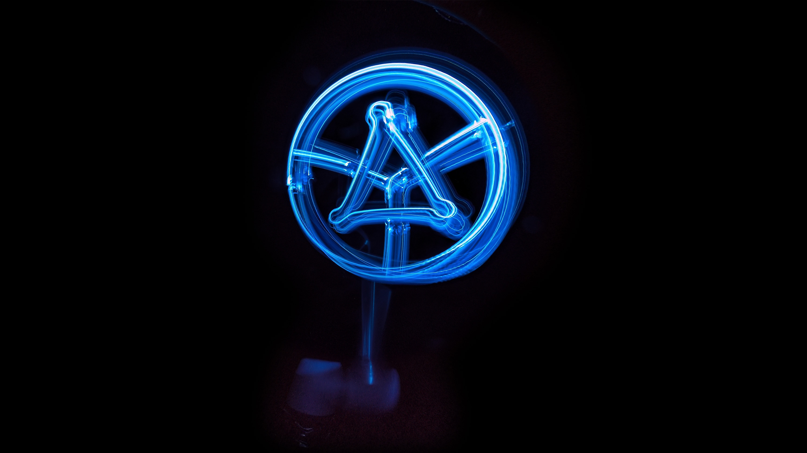

# Taller de fabricación digital con COMPAS FAB

> 8-10-15 Marzo 2022

👉 [Presentación](https://docs.google.com/presentation/d/15yLLKv6W3ld0PMNl8Bb22njB9GQ33CGZL1jOqBRUKS8) | [General](#general) | [Ejemplos](examples/) | [Requisitos](#requisitos) | [Instalación](#instalación)

## General

### Día 1

* Introducción a la fabricación digital.
* Introducción a COMPAS framework.
* Conceptos fundamentales de robótica: componentes de un robot industrial, área de trabajo de un robot, modos de control, posicionamiento de un robot y singularidades, marcos de coordenadas de un robot y transformaciones.
* Descripción de modelos de robots, el formato URDF, visualización de modelos de robots, interoperabilidad con modelos en sistemas externos. Ejercicio: construye tu propio modelo de robot.
* Cinemática directa e inversa (solución analítica y numérica).

### Día 2

* Backends de robótica.
* ROS: Robot Operating System y el framework de planificación MoveIt!. Modelo de comunicación de ROS: topics, services y actions.
* Planificación de movimiento: planificación en espacio cartesiano y en espacio libre utilizando MoveIt. Definición de restricciones de objetivo.
* Manipulación de la escena de planificación. Fijación y separación dinámica de end-effectors.
* Ejercicio: planificación de movimiento de una tarea de pick & place.

### Día 3

* Comparación de modos de control: offline, online en real-time, online non-real-time.
* Control de robots ABB con COMPAS RRC.
* Primitivas de control de RRC: bloqueantes, no-bloqueantes, y bloqueo diferido.
* Set de instrucciones de RRC: movimiento, control de IO, personalización.
* Control de robots UR con ur_online_control.
* Control de robots UR con drivers de ROS-Industrial.

## Requisitos

* Sistema Operativo mínimo: Windows 10 Pro or Mac OS Sierra 10.12
* [Anaconda 3](https://www.anaconda.com/distribution/)
* [Docker Desktop](https://www.docker.com/products/docker-desktop) Una vez instalado, puede ser necesario activar la opción de `"Virtualization"` en el BIOS del ordenador, especialmente si se usa Windows.
* [Blender 3.0](https://www.blender.org/download): Es recomendable utilizar la version portable para aislar en entorno de trabajo.
* [Visual Studio Code](https://code.visualstudio.com/): Cualquier editor de python funciona, pero es recomendable utilizar VS Code junto con algunas extensiones, [consultar la documentación para mas detalles](https://gramaziokohler.github.io/compas_fab/latest/getting_started.html#working-in-visual-studio-code).

## Instalación

Utilizamos `conda` para asegurar un entorno limpio y aislado de dependencias.

Primera vez utilizando  <code>conda</code>?

Ejecutar primero el siguiente comando al menos una vez:

    (base) conda config --add channels conda-forge

    (base) conda env create -f https://dfab.link/db22.yml

### Verificación de la instalación

    (fab22) python -m compas

    Yay! COMPAS is installed correctly!

    COMPAS: 1.14.1
    Python: 3.9.10 (CPython)
    Extensions: ['compas-fab', 'compas-cgal', 'compas-rrc']

### Materiales del taller

    (base)  conda activate fab22
    (fab22) cd Documentos
    (fab22) git clone https://github.com/gramaziokohler/workshop_donbosco_2022

### Instalación en Blender

#### Opción 1

Instalar paquetes utilizando el interprete de python embebido en Blender 3.0.

    (base)  cd DIRECTORIO_DE_BLENDER
    (base)  cd 3.0/python/bin
    (base)  python -m pip install compas_fab

#### Opción 2

Utilizar Blender 3.0.1. portable con `COMPAS FAB` pre-instalado: https://wolke.ethz.ch/s/29RaC347tqzgB3z

Simplemente debe bajarse el archivo y descomprimir en una carpeta a elección.

Esta opcion solo está disponible para Windows.
